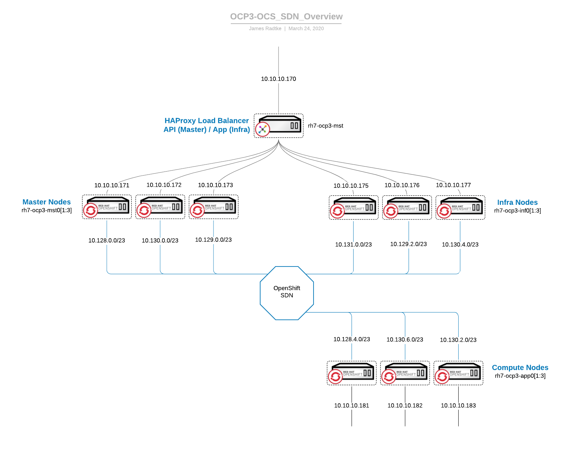

# OpenShift 3 SDN Overview

Status:   Work in Progress  
Purpose:  To provide an overview and details of:  
"Internal" SDN Subnets on each host   
"External" IP Endpoints  

## Preamble
This example provides context in regards to a single app  
  project:      openshift-console  
  application:  console  
  host(s):      rh7-ocp3-mst0[1:3]

The console is running on the Master Nodes, in an H/A configuration (in this case, 3-way).  
To access the console you would you provide the URL (cluster-console.ocp3-mwn.linuxrevolution.com).  That hostname returns an IP of the Load Balancer which directs traffic to the Infrastructure Nodes.  
The Infra Nodes (listening on 10.10.10.175/176/177) would then direct the request to the appropriate pods (again, running on the Master Nodes)  

## Architecture
The architecture I used is essentially a Reference Architecture consisting of the following:  
3 x Master Nodes  
3 x Infrastructure Nodes  
3 x Compute 

| Hostname | Host IP | Docker Subnet * |
|:---------|:-------:|:-------------:|
| rh7-ocp3-app01.matrix.lab | 10.10.10.181 | 10.128.4.0/23
| rh7-ocp3-app02.matrix.lab | 10.10.10.182 | 10.130.6.0/23
| rh7-ocp3-app03.matrix.lab | 10.10.10.183 | 10.130.2.0/23
| rh7-ocp3-inf01.matrix.lab | 10.10.10.175 | 10.131.0.0/23
| rh7-ocp3-inf02.matrix.lab | 10.10.10.176 | 10.129.2.0/23
| rh7-ocp3-inf03.matrix.lab | 10.10.10.177 | 10.130.4.0/23
| rh7-ocp3-mst01.matrix.lab | 10.10.10.171 | 10.128.0.0/23
| rh7-ocp3-mst02.matrix.lab | 10.10.10.172 | 10.130.0.0/23
| rh7-ocp3-mst03.matrix.lab | 10.10.10.173 | 10.129.0.0/23
| rh7-ocp3-ocs01.matrix.lab | 10.10.10.191 | 10.128.2.0/23
| rh7-ocp3-ocs02.matrix.lab | 10.10.10.192 | 10.131.2.0/23
| rh7-ocp3-ocs03.matrix.lab | 10.10.10.193 | 10.129.4.0/23
| rh7-ocp3-ocs11.matrix.lab | 10.10.10.196 | 10.128.6.0/23
| rh7-ocp3-ocs12.matrix.lab | 10.10.10.197 | 10.131.4.0/23
| rh7-ocp3-ocs13.matrix.lab | 10.10.10.198 | 10.129.6.0/23

* The "Docker Subnet" values were retrieved manually post-install.

## Gather Data
While the non-routable address space which the nodes use is configurable to meet your needs (i.e. to avoid CIDR conflicts with your existing infrastructure) I have utilized the defaults and allowed the installer to select the CIDR.


As I have opted to let the installer select the CIDR to utilize, I will need to retrieve the configuration.  

The 2 CIDR values of concern 
[OpenShift 3.11 - Configuring the Pod Network on Masters]https://docs.openshift.com/container-platform/3.11/install_config/configuring_sdn.html#configuring-the-pod-network-on-masters) explains the CIDR for the overall SDN.  

[OpenShift 3.11 Documentation - Network Subnetting](https://docs.openshift.com/container-platform/3.11/scaling_performance/network_optimization.html#scaling-performance-network-subnetting) explains the CIDR for each individual Nodes within the SDN.


The following command is helpful as it will provide the external IP for each node, as well as the CIDR assigned to each node "SUBNET" for Docker
```
# oc get hostsubnets
NAME                        HOST                        HOST IP        SUBNET          EGRESS CIDRS   EGRESS IPS
rh7-ocp3-app01.matrix.lab   rh7-ocp3-app01.matrix.lab   10.10.10.181   10.128.4.0/23   []             []
rh7-ocp3-app02.matrix.lab   rh7-ocp3-app02.matrix.lab   10.10.10.182   10.130.6.0/23   []             []
rh7-ocp3-app03.matrix.lab   rh7-ocp3-app03.matrix.lab   10.10.10.183   10.130.2.0/23   []             []
rh7-ocp3-inf01.matrix.lab   rh7-ocp3-inf01.matrix.lab   10.10.10.175   10.131.0.0/23   []             []
rh7-ocp3-inf02.matrix.lab   rh7-ocp3-inf02.matrix.lab   10.10.10.176   10.129.2.0/23   []             []
rh7-ocp3-inf03.matrix.lab   rh7-ocp3-inf03.matrix.lab   10.10.10.177   10.130.4.0/23   []             []
rh7-ocp3-mst01.matrix.lab   rh7-ocp3-mst01.matrix.lab   10.10.10.171   10.128.0.0/23   []             []
rh7-ocp3-mst02.matrix.lab   rh7-ocp3-mst02.matrix.lab   10.10.10.172   10.130.0.0/23   []             []
rh7-ocp3-mst03.matrix.lab   rh7-ocp3-mst03.matrix.lab   10.10.10.173   10.129.0.0/23   []             []
rh7-ocp3-ocs01.matrix.lab   rh7-ocp3-ocs01.matrix.lab   10.10.10.191   10.128.2.0/23   []             []
rh7-ocp3-ocs02.matrix.lab   rh7-ocp3-ocs02.matrix.lab   10.10.10.192   10.131.2.0/23   []             []
rh7-ocp3-ocs03.matrix.lab   rh7-ocp3-ocs03.matrix.lab   10.10.10.193   10.129.4.0/23   []             []
rh7-ocp3-ocs11.matrix.lab   rh7-ocp3-ocs11.matrix.lab   10.10.10.196   10.128.6.0/23   []             []
rh7-ocp3-ocs12.matrix.lab   rh7-ocp3-ocs12.matrix.lab   10.10.10.197   10.131.4.0/23   []             []
rh7-ocp3-ocs13.matrix.lab   rh7-ocp3-ocs13.matrix.lab   10.10.10.198   10.129.6.0/23   []             []
```

Retrieve the API endpoint (URL) for the console and cluster-console
```
# oc status
In project openshift-console on server https://rh7-ocp3-mst.matrix.lab:8443

https://cluster-console.ocp3-mwn.linuxrevolution.com (reencrypt) to pod port https (svc/console)
  deployment/console deploys registry.redhat.io/openshift3/ose-console:v3.11.170
    deployment #2 running for 12 days - 1/3 pods
    deployment #1 deployed 12 days ago

View details with 'oc describe <resource>/<name>' or list everything with 'oc get all'.
```


## Network Topology


## Let's piece this together 
Using the previous image, focus on the master nodes (for now) 
```
# oc get hostsubnet | grep mst
rh7-ocp3-mst01.matrix.lab   rh7-ocp3-mst01.matrix.lab   10.10.10.171   10.128.0.0/23   []             []
rh7-ocp3-mst02.matrix.lab   rh7-ocp3-mst02.matrix.lab   10.10.10.172   10.130.0.0/23   []             []
rh7-ocp3-mst03.matrix.lab   rh7-ocp3-mst03.matrix.lab   10.10.10.173   10.129.0.0/23   []             []
```

Retrieve the IP(s) for each of the openshift-console pods 
```
# oc get pods -n openshift-console -o wide
NAME                       READY     STATUS    RESTARTS   AGE       IP            NODE                        NOMINATED NODE
console-554bb5f54d-r5pl2   1/1       Running   0          12d       10.128.0.10   rh7-ocp3-mst01.matrix.lab   <none>
console-554bb5f54d-srjzw   1/1       Running   0          12d       10.130.0.9    rh7-ocp3-mst02.matrix.lab   <none>
console-554bb5f54d-wxw28   1/1       Running   0          13h       10.129.0.24   rh7-ocp3-mst03.matrix.lab   <none>
```

Notice that the IP assigned to the pod exists in the CIDR identified in "hostsubnet" output

Review the [OpenShift 3.11 - Admin Guide - SDN Troubleshooting](https://docs.openshift.com/container-platform/3.11/admin_guide/sdn_troubleshooting.html#the-interfaces-on-a-node) to see all the interfaces that are created, as well as the SDN flows inside a Node.
