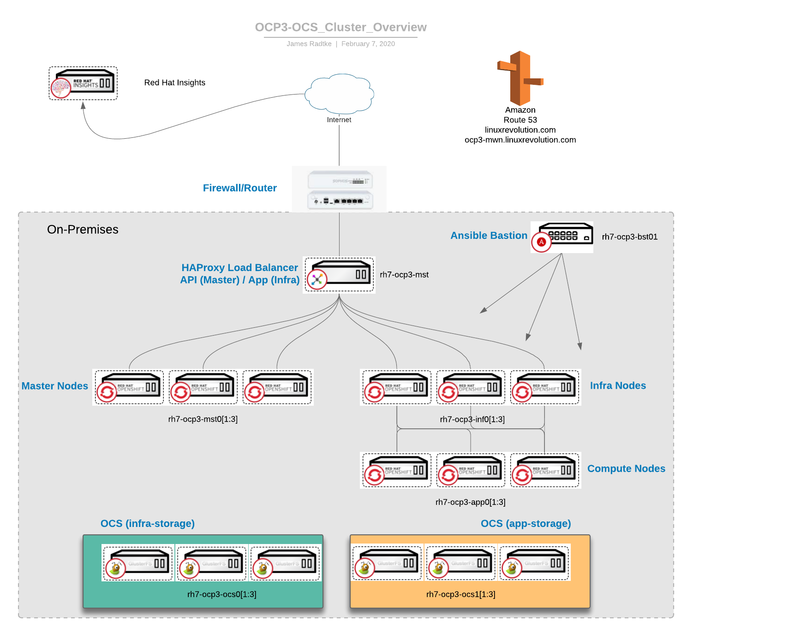

# MATRIX.lab (aka LINUXREVOLUTION.COM)

## Status
Untested.  I am currently making a TON of changes to make my lab Hyperconverged.  
Environment is currently being used to test OCP3.

## Overview
My Homelab dedicated to deploying portoins of the Red Hat product portfolio and AWS integration.
One of the goals (currently) is to build something somewhat "stateless" or shortlived.   
It is primarily an IaaS and PaaS initiative.  This is intended to be a "lab" 
installation - I would not use some of these tactics in a production or business
environment.

### Deployment Modes
* (current) Ad-hoc
* RHVH 4.3 
* RHHI = Hyperconverged - RHVH 4.2 + Gluster 
* RHEL as RHV Hypervisors and Hyperconverged (only RHEL 7.4 supported)
* RHV/RHELH with External Storage (iSCSI/NFS) from NAS host

The environment will firstly exist on the local storage of an infrastructure system (ZION).  
This system will have all the services necessary to build out the lab environment.   
* PXE/TFTP/DHCP
* ISO media shared via HTTP
* Clone of Git Repo(s)
Once the environment is ready to "switch on", the system should be able to disappear.

Also, this whole thing needs to be Ansible-ized at some point.  It's 2018....  

## Products
Red Hat Enterprise Linux (RHEL)  
Red Hat Ansible Tower  
Red Hat Identity Management  
Red Hat Storage (Gluster)  
Red Hat Open Container Platform (OpenShift)  
FreeNAS (not a Red Hat Product, not even running Linux - but, customers have it and I want to be familiar)

## PHYSICAL HOSTS (In-Use)
| Hostname | Purpose                  | Model, Proc, Mem Size                               | IP (public) | IP (storage) | Price (approx)
| :--------|:------------------------:| ---------------------------------------------------:|:-----------:|:------------:|:--------------|
| ZION     | Red Hat Enterprise Linux | NUC5i5RYB, Core(TM) i5-5250U CPU, 15G               | 10.10.10.10 | 172.16.10.10 | $900
| NEO      | Red Hat Enterprise Linux | HP ProLiant ML30 Gen9, Xeon(R) CPU E3-1220 v5 , 31G | 10.10.10.11 | 172.16.10.11 | $1200
| TRINITY  | Red Hat Enterprise Linux | HP ProLiant ML30 Gen9, Xeon(R) CPU E3-1220 v5 , 31G | 10.10.10.12 | 172.16.10.12 | $1200
| MORPHEUS | Red Hat Enterprise Linux | HP ProLiant ML30 Gen9, Xeon(R) CPU E3-1220 v6 , 62G | 10.10.10.13 | 172.16.10.13 | $1200
| SATI     | Red Hat Enterprise Linux | NUC7i7BNB, Core(TM) i7-7567U CPU , 7.5G             | 10.10.10.17 | 172.16.10.17 | $900
| APOC     | Red Hat Enterprise Linux | ASUS X99-PRO/USB 3.1, Xeon(R) CPU E5-2630 v3 , 94G  | 10.10.10.18 | 172.16.10.18 | $800

## PHYSICAL HOSTS (Idle)
| Hostname | Purpose                  | Model, Proc, Mem Size                               | IP (public) | IP (storage) | Price (approx)
| :--------|:------------------------:| ---------------------------------------------------:|:-----------:|:------------:|:--------------|
| SERAPH   | FreeNAS                  | ASRock Z77E-ITX, i5-3570K, 16GB                     | 10.10.10.19 | 172.16.10.19 | $800

Command to retrieve Manufacturer, Model, Proc, and Memory:  
```
echo "`dmidecode -s system-manufacturer` `dmidecode -s baseboard-product-name`,`lscpu | grep "^Model name:" | grep -o -P '(?<=Intel\(R\)).*(?=\@)'`, `free -h | grep "Mem:" | awk '{ print $2 }'`"
```

### ZION 
* KVM Hypervisor hosting the following Guests:
  * Web Server for LinuxRevolution.com
  Utility Host (rh8-util-srv01)
* Bastion host

### NEO/TRINITY/MORPHEUS
Our heroes will function as hypervisors or compute nodes.  
* RHV Hypervisors (or RHEL 7 as RHV Hypervisors)  
* These nodes will change purpose often.. not "long-running" hosts.

### SATI (might not use...)
* KVM Hypervisor and hosts the following Guests:  
  *  IDM (rh7-idm-srv02)

### APOC (the workhorse)
* This box has a lot of disk and memory to run the long-running VMs.
* KVM Hypervisor hosting the following Guests:  
  *  Satellite 6 (rh7-sat6-srv01)
  *  IDM (rh7-idm-srv01)

### SERAPH
* NAS host for NFS and iSCSI

### Other Infrastructure Systems
  *  Ansible Tower?
  *  Nagios/libreNMS

## IaaS/PaaS layout 
NOTE:  These memory values are not yet solidified.

| Hostname          |            Product              |  Purpose             | Proc, Mem Size | Hypervisor |
| :---------------- |:-------------------------------:|:--------------------:| --------------:|:----------:|
| RH7-IDM-SRV01     | Red Hat Identity Management     | IdM and DNS          | 2, 1024m       | zion       |
| RH7-LMS-SRV01     | libreNMS                        | Monitoring           | 2, 1024m       | zion       |
| RH8-UTIL-SRV01    | Red Hat Enteprise Linux         | Util, DMZ Bastion    | 2, 1024m       | zion       |
| ----------------- | ------------------------------- | ---------------------| -------------- | ---------- | 
| RH7-SAT6-SRV01    | Red Hat Satellite 6             | Host Management      | 2, 4096m       | sati       |
| RH7-IDM-SRV02     | Red Hat Identity Management     | IdM and DNS          | 2, 1024m       | sati       |
| RH7-OCP3-BST      | Red Hat Enteprise Linux         | Ansible Bastion      | 2, 2048m       | sati       |
| ----------------- | ------------------------------- | ---------------------| -------------- | ---------- | 
| RH7-OCP3-PROXY    | Red Hat Enterprise Linux        | HAproxy for OCP      | 2, 2048m       | RHV        |
| RH7-OCP3-MST01    | Red Hat OCPv3                   | Master Node          | 2, 5120m       | RHV        |
| RH7-OCP3-MST02    | Red Hat OCPv3                   | Master Node          | 2, 5120m       | RHV        |
| RH7-OCP3-MST03    | Red Hat OCPv3                   | Master Node          | 2, 5120m       | RHV        |
| RH7-OCP3-INF01    | Red Hat OCPv3                   | Infrastructure Node  | 2, 4096m       | RHV        |
| RH7-OCP3-INF02    | Red Hat OCPv3    	              | Infrastructure Node  | 2, 4096m       | RHV        |
| RH7-OCP3-INF03    | Red Hat OCPv3    	              | Infrastructure Node  | 2, 4096m       | RHV        |
| RH7-OCP3-APP01    | Red Hat OCPv3   	              | Application Node     | 2, 5120m       | RHV        |
| RH7-OCP3-APP02    | Red Hat OCPv3                   | Application Node     | 2, 5120m       | RHV        |
| RH7-OCP3-APP03    | Red Hat OCPv3                   | Application Node     | 2, 5120m       | RHV        |
| RH7-OCP3-OCS01    | Red Hat OCPv3 (w/OCS)           | Storage Node (infra) | 3, 8192m       | RHV        |
| RH7-OCP3-OCS02    | Red Hat OCPv3 (w/OCS)           | Storage Node (infra) | 2, 8192m       | RHV        |
| RH7-OCP3-OCS03    | Red Hat OCPv3 (w/OCS)           | Storage Node (infra) | 2, 8192m       | RHV        |
| RH7-OCP3-OCS04    | Red Hat OCPv3 (w/OCS)           | Storage Node (infra) | 2, 8192m       | RHV        |
| RH7-OCP3-OCS11    | Red Hat OCPv3 (w/OCS)           | Storage Node (apps)  | 2, 8192m       | RHV        |
| RH7-OCP3-OCS12    | Red Hat OCPv3 (w/OCS)           | Storage Node (apps)  | 2, 8192m       | RHV        |
| RH7-OCP3-OCS13    | Red Hat OCPv3 (w/OCS)           | Storage Node (apps)  | 2, 8192m       | RHV        |
| RH7-OCP3-OCS14    | Red Hat OCPv3 (w/OCS)           | Storage Node (apps)  | 2, 8192m       | RHV        |
       
| Node Type       | Description     |
| :-------------- |:---------------:|
| Master          | Manages OCP Cluster, Hosts API, endpoint for Nodes to "check-in" for work
| ETCD            | (Now on Master) ETCD Nodes provide the clustered OCP object key-pair store
| Infrastructure  | Nodes which will host container such as the registry and routers
| Application     | Application nodes will provide Docker for hosting containers
| Storage (apps)  | Hosting either Application or 
| Storage (infra) | Infrastrcture (metrics, monitoring, logging, registry) 



## External Repos

| Repo | URL   |
| :--: | :---- |
| EPEL | https://fedoraproject.org/wiki/EPEL |
| HP   | http://downloads.linux.hpe.com/SDR/repo/ |

## HARDWARE OVERVIEW
<pre>
                -------------------
 Sophos XG UTG  |   Mr Firewall   |       
                -------------------  
                        |||                -------
                        |||               |      |
                -------------------       |______| Laptop
  Cisco SG300   |    Mr Switch    | --->  /      /
                -------------------      /______/
                        |||
                        |||
                        \ /
                  ---------------
                  |             |
                  |             |
                  |    ZION     |
                  |             |
                  |             |
                  ---------------
                  /      |       \
                 /       |        \
                /        |         \
 ---------------  ---------------  ---------------
 |             |  |             |  |             |
 |             |  |             |  |             |    
 |     NEO     |  |   TRINITY   |  |   MORPHEUS  |    ** COMPUTE RHV **
 |             |  |             |  |             |
 |             |  |             |  |             |        HPE-ML30
 ---------------  ---------------  ---------------
                        |||
                        |||
                        \ /
        ---------------     ---------------
        |             |     |             |
        |             |     |             |
        |    APOC     |     |   SERAPH    |    ** ADMIN/UTILITY **
        |             |     |   (NAS)     |        APOC / Asus
        |             |     |             |      SERAPH / ASrock 
        ---------------     ---------------
</pre>

### Storage Layout

| Hostname            | vda | vdb    | vdc 
|:--------------------|:----|:-------|:---
| rh7-ocp3-bst01      | OS  | Docker | N/A (NFS exports (registry, metrics))
| rh7-ocp3-proxy      | OS  | Docker | N/A
| rh7-ocp3-mst0[1:3]  | OS  | Docker | N/A
| rh7-ocp3-inf0[1:3]  | OS  | Docker | N/A
| rh7-ocp3-app0[1:3]  | OS  | Docker | N/A
| rh7-ocp3-ocs0[1:4]  | OS  | Docker | GlusterFS (infra)
| rh7-ocp3-ocs1[1:4]  | OS  | Docker | GlusterFS (apps)

## Switch Layout

| Switch Port | Host Interface    | Switch Port | Host Interface   |
|:-----------:|:-----------------:|:-----------:|:----------------:|
|  gi1  | zion                    | gi2  | seraph-eno1             |
|  gi3  | seraph-ens3f0 (LAG1)    | gi4  | seraph-ens3f1 (LAG1)    |
|  gi5  | neo-eno1                | gi6  | neo-eno2 (ilom)         |
|  gi7  | neo-ens3f0 (LAG2)       | gi8  | neo-ens3f1 (LAG2)       |
|  gi9  | neo-ens3f2 (LAG3)       | gi10 | neo-ens3f3 (LAG3)       |
|  gi11 | trinity-eno1            | gi12 | trinity-eno2 (ilom)     |
|  gi13 | trinity-ens3f0 (LAG4)   | gi14 | trinity-ens3f1 (LAG4)   |
|  gi15 | trinity-ens3f2 (LAG5)   | gi16 | trinity-ens3f3 (LAG5)   |
|  gi17 | morpheus-eno1           | gi18 | morpheus-eno2 (ilom)    |
|  gi19 | morpheus-ens3f0 (LAG6)  | gi20 | morpheus-ens3f1 (LAG6 ) |
|  gi21 | morpheus-ens3f2 (LAG7)  | gi22 | morpheus-ens3f3 (LAG7 ) |
|  gi23 | apoc-ens3f0 (LAG8)      | gi24 | apoc-ens3f1 (LAG8)      |
|   -   |         --              |   -  |           --            |
|  gi25 | apoc-eno1               | gi26 |                         |
|  gi27 |                         | gi28 |         UPLINK          |

## 802.3ad LAG groups (configured on Mr Switch)
LAG1 - seraph-storage  
LAG2 - neo-guestnet  
LAG3 - neo-storage  
LAG4 - trinity-guestnet  
LAG5 - trinity-storage   
LAG6 - morpheus-guestnet   
LAG7 - morpheus-storage  
LAG8 - (unassigned)
</pre>

## OCP Overview
<pre>
                  --------------
                  |            |
                  |            |
                  |     LB     |       rh7-ocp3-proxy
                  |            |   Load Balancer (haproxy)  
                  |            |
                  --------------                     --------------
                   /     |     \                     |            | 
                  /      |      \     rh7-ocp3-bst01 |   Bastion  |    
                 /       |       \                   |            | 
                /        |        \                  |            | 
               /         |         \                 -------------- 
 -------------+-  -------+------  -+------------   
 |             |  |            |  |            |
 |             |  |            |  |            |
 |   MASTER    |  |   MASTER   |  |   MASTER   |   rh7-ocp3-mst0[1:3]  
 |             |  |            |  |            |   Master Nodes / ETCD 
 |             |  |            |  |            |      (webUI/API)
 ---------------  --------------  --------------        
 |                                             |  
 ---------------  --------------  --------------
 |             |  |            |  |            |
 |             |  |            |  |            |
 |    INFRA    |  |   INFRA    |  |   INFRA    |   rh7-ocp3-inf0[1:3]  
 |             |  |            |  |            |     INFRA Nodes 
 |             |  |            |  |            |      (Routers)
 ---------------  --------------  --------------        
           |   \        /\         /  |
           |    \      /  \       /   |
           |     \    /    \     /    |
           |      \  /      \   /     |
           |       \/        \ /      | 
 ---------------  --------------  --------------
 |             |  |            |  |            |
 |             |  |            |  |            |
 |     APP     |  |    APP     |  |    APP     |   rh7-ocp3-app0[1:3]  
 |             |  |            |  |            |      APP Nodes 
 |             |  |            |  |            |    (Applications)
 ---------------  --------------  --------------        

 ---------------  --------------  -------------- --------------
 |             |  |            |  |            | |            |
 |             |  |            |  |            | |            |
 |     OCS     |  |    OCS     |  |    OCS     | |    OCS     |    rh7-ocp3-ocs0[1:4]  
 |             |  |            |  |            | |            |    Storage-Infra Nodes 
 |             |  |            |  |            | |            | (logging,metrics,registry)
 ---------------  --------------  -------------- --------------       

 ---------------  --------------  -------------- --------------
 |             |  |            |  |            | |            |
 |             |  |            |  |            | |            |
 |     OCS     |  |    OCS     |  |    OCS     | |    OCS     |  rh7-ocp3-ocs1[1:4]  
 |             |  |            |  |            | |            |   Storage-App Nodes 
 |             |  |            |  |            | |            |    (Application)
 ---------------  --------------  -------------- --------------       
</pre>

## ISSUES:
Intel NUC only has a single NIC.  A problem that can be remedied easily enough, but since I had another ITX-based machine laying around, it made sense to go that route.
Intel NUC also has issues when I run my build script for KVM guests.  I don't have time to deal with that crap at this time.  So, I'll run the Asus for now.

## Build Steps
* Build laptop from DVD (manually, but reference a kickstart @ github)
  * register to RHN
  * Install/Configure PXE/tftp/HTTP/DNS
  * share out DVD ISO sources via HTTP
  * build RH7-IDM-SRV01 as KVM guest
* Build ZION from Network and register to RHN.
  * populate /etc/hosts using the entire list of KVM guests
  * Build RH7-SAT6-SRV01 and register to RHN (sync channels)
  * Build RH7-IDM-SRV01/02 and register to RH7-SAT6-SRV01
    * update DNS using 'ipa' command found in finish script
  * Update DNS resolvers on all hosts to now point to the IDM systems
  * Build RH6RHVMGR
* Build SERAPH and create iSCSI targets and NFS shares (for OpenShift)
  * build RH7-IDM-SRV02 as KVM guest
* Build NEO/TRINITY/MORPHEUS with BaseOS (RHV/RHEL)
* Attach NEO and TRINITY to RH7-RHV4-MGR01 to make them RHV Hypervisors
* point RHV Manager at SERAPH for Storage

## NOTES
To begin building the environment, I utilize:
 - a build_KVM.sh script, which relies on .myconfig to identify parameters about each host.
 - \<HOSTNAME\>.ks file which is the kickstart file (anaconda-ks.cfg) for each host
 - ./post_install.sh a script that *should* end up in /root post kickstart.  This script registers node to Satellite and performs some housekeeping.
 - finish_\<HOSTNAME\>.sh which should contain all the post-build steps

```
# echo "RH7-IDM-SRV:EL7:4:1536:50:200:server:7.5:BIOS" >> .myconfig
# ./build_KVM.sh RH7-IDM-SRV
# ssh-copy-id RH7-IDM-SRV
# ssh RH7-IDM-SRV01
# ./post_install.sh
# wget http://10.10.10.10/finish_`hostname -f`.sh
# chmod u+x finish_`hostname -f`.sh
# ./finish_`hostname -f`.sh
```

## OCP3 URLs
https://ocp3-console.linuxrevolution.com:8443/console/  
https://cluster-console.ocp3-mwn.linuxrevolution.com/  
https://logging.ocp3-mwn.linuxrevolution.com/app/kibana  

https://hawkular.ocp3-mwn.linuxrevolution.com  (Endpoint Only - no User WebUI)

### Monitoring
NOTE:  These URLs are based on the "openshift_master_default_subdomain"  
https://prometheus-k8s-openshift-monitoring.ocp3-mwn.linuxrevolution.com/  
https://grafana-openshift-monitoring.ocp3-mwn.linuxrevolution.com  
https://alertmanager-main-openshift-monitoring.ocp3-mwn.linuxrevolution.com  
https://registry-console-default.ocp3-mwn.linuxrevolution.com/registry  
https://docker-registry-default.ocp3-mwn.linuxrevolution.com/  

## Converting to Aperture.lab
<pre>
rsync -tugrpolvv --exclude "README.md" --exclude "images" --exclude "*ilo*" /data/Projects/matrix.lab/ /data/Projects/aperture.lab/
sed -i -e 's/matrix.lab/aperture.lab/g' /data/Projects/aperture.lab/*.{ks,sh,txt,hosts,html}
sed -i -e 's/matrix/aperture/g' /data/Projects/aperture.lab/*.{ks,sh,txt,hosts,html}
sed -i -e 's/matrix/aperture/g' /data/Projects/aperture.lab/scripts/*.{ks,sh,txt,hosts,html}
sed -i -e 's/MATRIX/APERTURE/g' /data/Projects/aperture.lab/*.{ks,sh,txt,hosts,html}
sed -i -e 's/MATRIX/APERTURE/g' /data/Projects/aperture.lab/scripts/*.{ks,sh,txt,hosts,html}
sed -i -e 's/10.10.10.10/192.168.122.1/g' /data/Projects/aperture.lab/*.{ks,sh,txt,hosts,html}
sed -i -e 's/10.10.10.in/122.168.192.in/g' /data/Projects/aperture.lab/finish_rh7-idm-srv01.sh
sed -i -e 's/10.10.10./192.168.122./g' /data/Projects/aperture.lab/finish_rh7-idm-srv01.sh
sed -i -e 's/10.10.10./192.168.122./g' /data/Projects/aperture.lab/hosts
</pre>

